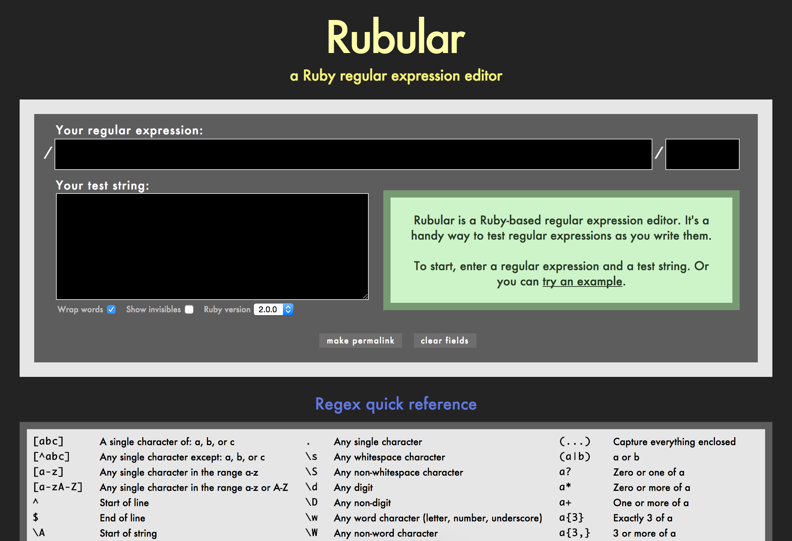

# [fit] Five Rooby Tips

---


# Justin Burris

---


---

# The Five Tips

1. The Quick Draw

2. The Reductionist

3. The Expressive Regular

4. The Exorcist

5. The Hired Gun

---

# Tip One : The Quick Draw

_ruby 2.0+_

options and keyword arguments

---

##### Tip One : The Quick Draw

## Options arguments

```ruby
def hash_args(options: {})
  options[:one_of_many]
end

hash_args({one_of_many: "one of all",
           the_underrated_one: "I'll never be returned"})
=> "one of all"
```

---

##### Tip One : The Quick Draw

## Keyword arguments

```ruby
def hash_args(options: {})
  options[:one_of_many]
end

def keyword_args(one_of_many: nil, the_underrated_one: nil)
  one_of_many
end

keyword_args({one_of_many: "one of all",
              the_underrated_one: "I'll never be returned"})
=> "one of all"
```

---

# Tip Two : The Reductionist

_ruby 1.8.7+_

map & reduce

---

##### Tip Two : The Reductionist

## Map

```ruby
secret_value = 10
[1,2,3].map do |number|
  number * secret_value
end

=> [10,20,30]
```

---

##### Tip Two : The Reductionist

## Reduce

```ruby
[1,2,3].reduce(0) |accumulator, number|
  accumulator + number
end

=> 6
```

---

##### Tip Two : The Reductionist

## Reduce

```ruby
[1,2,3].reduce(0) |accumulator, number|
  accumulator + number
end

=> 6
```

_bonus!_

If you have a symbol, reudce is a breeze

```ruby
[1,2,3].reduce(0, :+)

=> 6
```

---

# [fit] Map is also known as
# [fit] `collect`

---

# [fit] Reduce is also known as
# [fit] `inject`

---

# Tip Three : The Expressive Regular

_ruby 1.8.6+_

Generate complex regular expressions with less escaping

---

##### Tip Three : The Expressive Regular

## Using `//` to deliniate a regular expression

```ruby
/some_text/
```

---

##### Tip Three : The Expressive Regular

## Using `//` to deliniate a regular expression

```ruby
/some_text/
```

```ruby
/http:\/\/www.mysite.com\//  # ugh what?
```

---

##### Tip Three : The Expressive Regular

## Using `%r` and `{}`

```ruby
%r{http://mysite.com/} # My sanity, it has returned!
```

---

# Tip Four : The Exorcist

_ruby 1.9.1+_

daemon and fork

---

##### Tip Four : The Exorcist

## Sending a process to the background

```ruby
Process.daemon
```

---

# [fit] But what if you want a
# [fit] PID?

---

##### Tip Four : The Exorcist

## Use Fork!

```ruby
if pid = fork
  File.write('/var/run/super_awesome_ruby_program.pid', pid)
  Process.detach(pid)
  exit
end
```

---

# Tip Five : The Hired Guns

* rubular
* pry-remote
* graphite
* remark.js

---



---

##### Tip Five : The Hired Guns

## pry-remote

Dig into those pesky errors, in your console

https://github.com/Mon-Ouie/pry-remote

---

##### Tip Five : The Hired Guns

## pry-remote

Dig into those pesky errors, in your console

https://github.com/Mon-Ouie/pry-remote

```ruby
require 'pry-remote'

class FooController
  def bar_action
    binding.remote_pry
  end
end
```

```
www.wobsite.com/foo/bar_action
```

---

##### Tip Five : The Hired Guns

## pry-remote

Dig into those pesky errors, in your console

https://github.com/Mon-Ouie/pry-remote

```ruby
require 'pry-remote'

class FooController
  def bar_action
    binding.remote_pry
  end
end
```

```
www.wobsite.com/foo/bar_action
```

```sh
[pry-remote] Waiting for client on drb://localhost:9876
$ pry-remote
```

---

##### Tip Five : The Hired Guns

## pry-remote

Dig into those pesky errors, in your console

https://github.com/Mon-Ouie/pry-remote

```ruby
require 'pry-remote'

class FooController
  def bar_action
    binding.remote_pry
  end
end
```

```
www.wobsite.com/foo/bar_action
```

```sh
[pry-remote] Waiting for client on drb://localhost:9876
$ pry-remote
```

Combine with better\_errors for even more flexibility in debugging

---

##### Tip Five : The Hired Guns

## Graphite

Log everything over UDP!

http://graphite.wikidot.com/

---

##### Tip Five : The Hired Guns

## Graphite

Log everything over UDP!

http://graphite.wikidot.com/

_In real time!_

---

##### Tip Five : The Hired Guns

## Remark.js

https://github.com/gnab/remark

http://remarkjs.com/

---

# [fit] Thanks!

# [fit] github.com/justinbburris/slides

---

# [fit] Twitter
# [fit] @justinbburris

---

# [fit] Github
# [fit] /justinbburris
