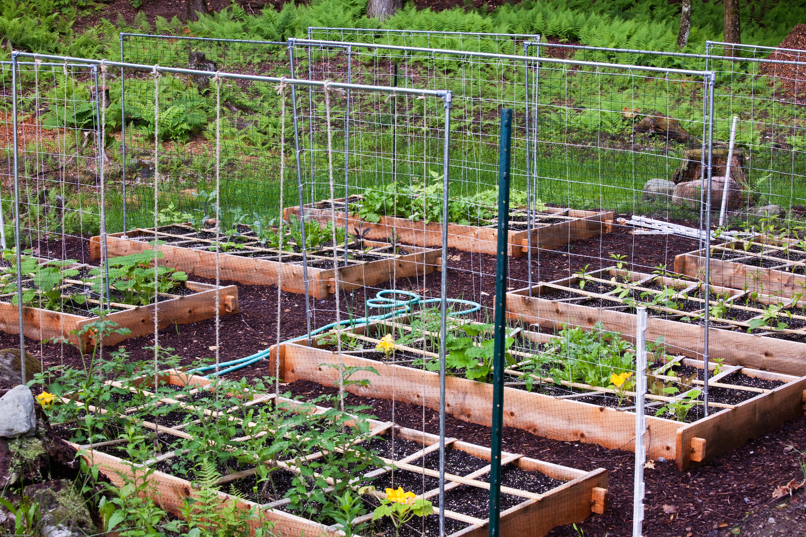

footer:  *@justinbburris*

# [fit] Dev To
# [fit] DevOps

###### © Justin Burris - Feb 2015

---

# Justin Burris

---

---

# Heads up

1. Automation
1. Processes
1. Upkeep

---

# But first
# [fit] why
---

# Automation

* How I Learned to Stop Worrying and Love the Bomb

---

# [fit] Automate
# Early

---

##### Automation

# Have easy to use
# [fit] Checkpoints

---

##### Automation

## Make
## Your
## System
## Modular

---

##### Automation

## Make long running jobs

# [fit] Visible

---

#### Automation

## Make it painless

# to build from scratch

---

##### Automation

## Create an Assembly Line

<a name="assembly-line"/>

---

# Process

* The beatings will continue until morale improves

---

##### Process

### Give the dev team
# what they need

---

#### Process

## Diagram in
# multiple levels of
# [fit] fidelity

---

### Process

# Write down everything
* And, I mean everything!

---

##### Process

# Pair often on
# configuration
# & discovery

---

##### Process

# Pair sparingly
# on tasks you
# can automate

---

##### Process

# Explicit is better
# [fit] than implicit

---

##### Process

# [fit] Validate
# [fit] what you build

---

# Upkeep

* You must construct additonal pylons

---

##### Upkeep

# Have A
# [fit] Utility Belt

---

### Upkeep

# Our utility belt

- VMWare + RBVMoni + VSphere
- Ansible
- Packer
- Trello

---

##### Upkeep

### Make the pain / development tradeoff

# [fit] Everyday

---

##### Upkeep

## Do not assume your app
## will copy & paste into
## production

---

##### Upkeep

# Experiencing issues?
# [fit] Profile
# [fit] backwards

---

#### Upkeep

## Keep your garden tended

<a name="garden"/>

---

# tl;dr

1. Automation
  * Create an assembly line
1. Process
  * Validate what you build
1. Upkeep
  * Keep your garden tended

---

# [fit] Thanks!

# [fit] github.com/justinbburris/slides

---

# [fit] Twitter
# @justinbburris

# [fit] Github
# /justinbburris

---

## Images

Production Line
[http://en.wikipedia.org/wiki/File:Consolidated\_TB-32\_production\_line.jpg](#assembly-line)

Garden
[https://flic.kr/p/6BC6Yd](#garden)
