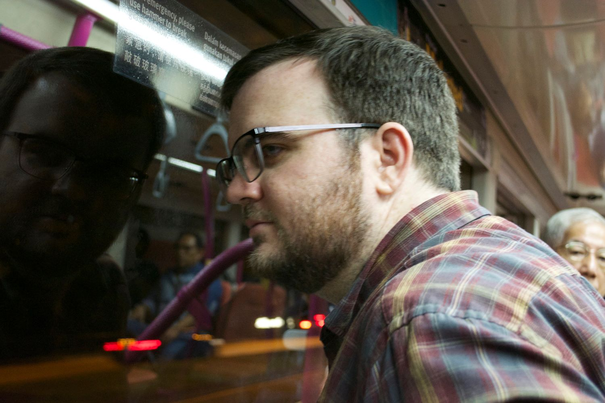
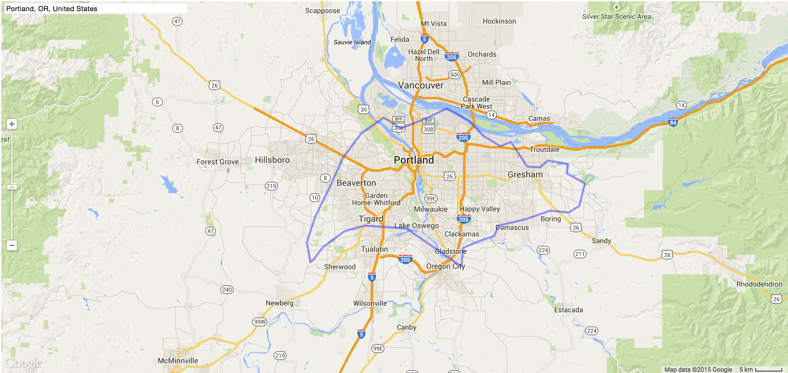

# An American
# in Singapore

---

# Justin Burris

---

# [fit] <3 PDXRuby
---

# [fit] Please ask questions!

---

## What is Singapore?

---

## Statistics

* 5.26 million people
* $55,182.42 GDP per capita (53k in US)
* 18,513 people per mile squared
* 17% of households have over $1,000,000
* $1.20 kopi (kopi)
* $3-$4 food options
* 28% of population are expats

---

---

---

---

---

---

---

# Why go?

---

## Why go?

Travel all over South East Asia

---

---

## Why go?

Work with a diverse team

---

## Why go?

Interesting work

* Startups
* Unique SEA opportunities
* Banking

---

## Why go?

Stable economy

---

## Why go?

# [fit] Safe

---

# Why not?

---

## Why not?

# [fit] Expensive

---

## Why not?

Hot! Hot! Hot!

---

---

## Why not?

Cultural friction & different social norms

---

---

## Why not?

Less opportunity than U.S.

---

## Why not?

Low number of western cultural events

---

## Why not?

Very different freedoms & lack of a free press

---

# How to contribute?

---

## How to contribute

* Hackerspace.SG
* block71
* JFDI
* Others

---

## How to contribute

* Meetup.com
* (Ruby user's group is awesome)
* Facebook groups

---

## How to contribute

consultancies (Neo, Thoughtworks, etc)

---

## How to contribute

banks (oh so many banks)

---

# Recommendations?

---

## Recommendations

Live like a local
and be a regular

---

---

## Recommendations

Understand local laws

---

## Recommendations

Find a good housing agent

---

## Recommendations

Record your thoughts when you visit new places

---

## Recommendations

Use this opportunity to evaluate yourself

---

## Recommendations

Remember you're the foreigner

---

## Recommendations

Have at least $10,000 USD when you arrive

* Or get a company to pay to move you

---

# Bring it home

---

#[fit] It's a Big Place Out There

---

## Bring it home

RailsCamp

* It's like a big group hug

---

## Bring it home

Be passionate about what you do

---

## Bring it home

* Safety
* Security
* Cleanliness

---

# [fit] Thanks!

### Slides: github.com/justinbburris/slides

### Twitter: @justinbburris
